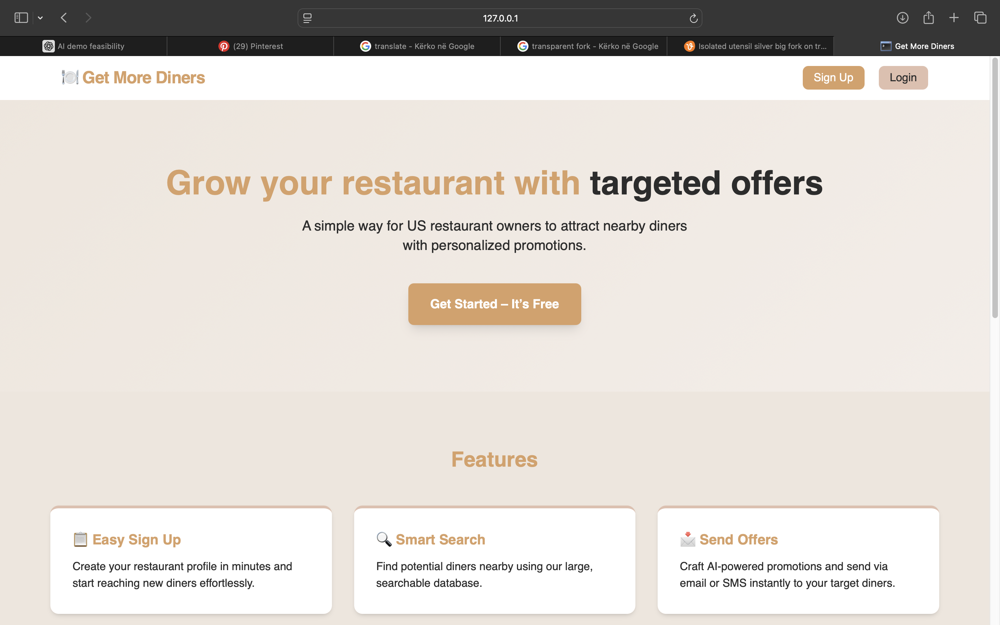
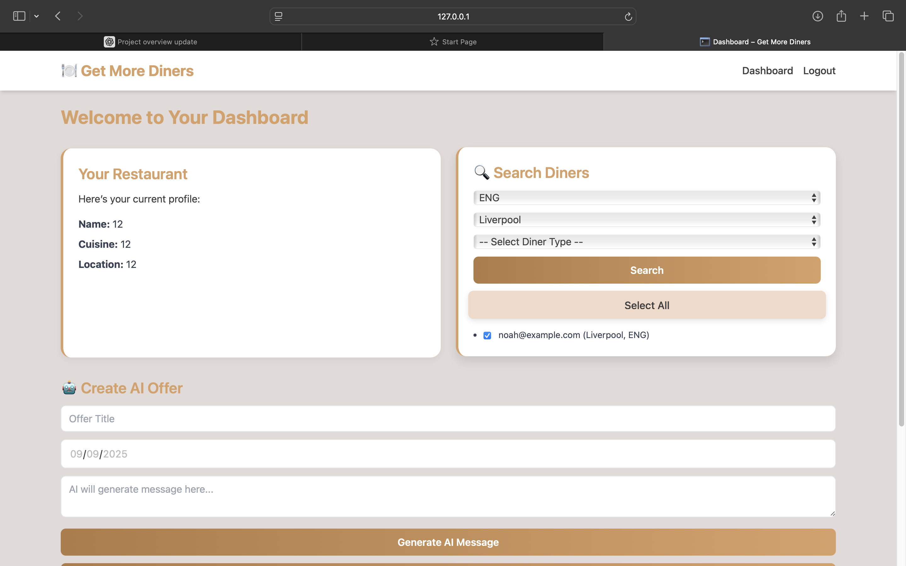
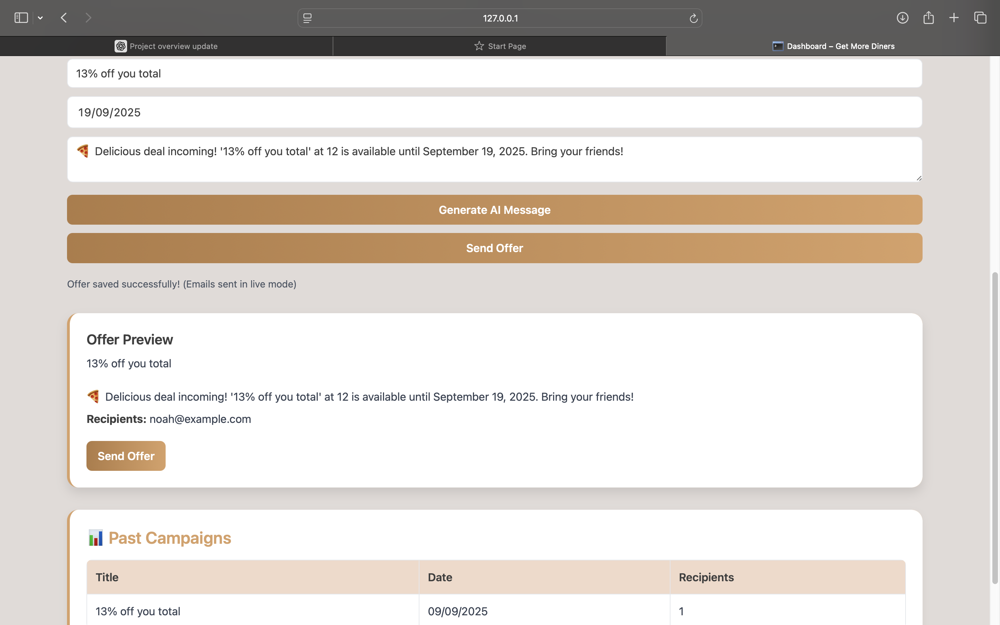

# Get More Diners
A Smart Dashboard for Restaurant Owners to Boost Engagement with AI-Powered Promotions

## 🚀 Project Overview
Get More Diners is a web application designed to empower restaurant owners with AI-driven promotional tools. It enables them to create compelling offers, analyze diner data, and track campaign performance—all from a user-friendly dashboard.

## 🗄️ Database Overview
The backend is powered by a PostgreSQL database hosted on Supabase, using the default public schema. This schema is exposed via the Supabase Data API for seamless frontend integration.

### Current Tables
restaurants → Stores restaurant details (name, location, contact info).

diners → Contains diner records including name, email, and diner preferences.

offers → Holds promotional offers (title, description, start & end dates, linked to a restaurant).

campaigns → Tracks promotional campaigns, their status, and performance metrics.

## Example Relationship Diagram

A restaurant can create many offers.

An offer can belong to a campaign.

A diner can be targeted by multiple campaigns.

## Supabase Features in Use

Row Level Security (RLS): Ensures users can only access their own data.

Policies: Restrict access to authenticated users.

Supabase Data API: Simplifies communication between the frontend (Flask app) and database.

## 🔐 Security Considerations
To ensure data privacy and integrity, Row Level Security (RLS) is enabled on all tables within the public schema. This restricts access to data based on the user's authentication status and defined policies.

## 🧠 Key Features
AI-Generated Promotional Offers: Automatically generate creative and engaging promotional messages tailored to your restaurant's specials and target audience.

Diner Database: Maintain a comprehensive list of diners, including their contact information and preferences, to personalize marketing efforts.

Campaign History: Track past promotional campaigns, analyze their effectiveness, and refine future strategies.

Demo Mode: Experience the application's capabilities even without an API key, thanks to a built-in demo mode that simulates AI-generated content.

## 🖼️ Demo Screenshots

### Dashboard  
  

### AI-Generated Offer  
  

 

## ⚙️ Installation & Setup

Prerequisites:
1. Python 3.8+
2. Flask
3. Supabase account for database integration
4. OpenAI API key (for AI features)
Installation Steps:

### Clone the repository:
git clone https://github.com/alketabacka/Get-More-Diners.git
cd Get-More-Diners

### Create and activate virtual environment (recommended)
python3 -m venv venv
source venv/bin/activate    # Mac/Linux
venv\Scripts\activate       # Windows (PowerShell)

### Install dependencies:
pip install -r requirements.txt

### Set up environment variables:
OPENAI_API_KEY: Your OpenAI API key.
SUPABASE_URL: Your Supabase project URL.
SUPABASE_KEY: Your Supabase project key.
DEMO_MODE: Set to True to enable demo mode.

### Run the application:
python app.py

Access the dashboard at http://127.0.0.1:5000.

## 🧪 Usage
Create a New Offer: Navigate to the "Create Offer" section, input your offer details, and let the AI generate a compelling promotional message.

View Diner Database: Access and manage your diner list, segmenting them based on preferences and engagement history.

Analyze Campaign Performance: Review past campaigns, monitor engagement metrics, and adjust strategies accordingly.

### 🧪 Demo Mode
In cases where the OpenAI API key limit is reached, the application switches to demo mode. This mode simulates AI-generated content, allowing users to experience the application's features without interruption.

{
  "message": "🎉 Attention food lovers! Your Restaurant has an amazing deal: '20% Off on All Drinks' available until September 30, 2025. Don't miss out!",
  "restaurant_name": "Your Restaurant"
}

### 🧪 API Endpoints
POST /generate-ai-offer
Generates an AI-powered promotional message based on the provided offer details.

### 🧪 Example AI Message

Here's an example of a promotional message generated by the AI:

{
  "message": "🍹 Sip, Savor, and Save! Enjoy 20% off on all drinks at Your Restaurant. Bring a friend and double the fun! Offer valid until September 30, 2025. Cheers to great times and great deals!",
  "restaurant_name": "Your Restaurant"
}

### 🧪 Demo Mode AI Message (Alternative)

In demo mode, the AI might generate a different promotional message:

{
  "message": "🎉 Attention food lovers! Your Restaurant has an amazing deal: '20% Off on All Drinks' available until September 30, 2025. Don't miss out on this delicious opportunity!",
  "restaurant_name": "Your Restaurant"
}

## 🔧 Technologies Used

Backend: Flask (Python)
Database: Supabase
AI Integration: OpenAI GPT-3.5-turbo
Frontend: HTML, CSS, JavaScript

